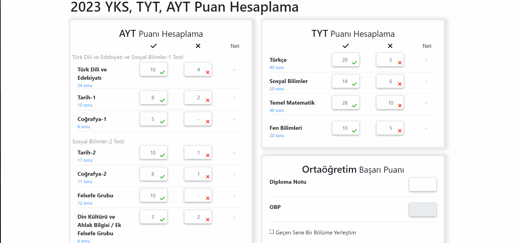

# :sparkles: Client Side Web
This repository includes some client side web projects.

### :pushpin: Landing Page 

This is a simple responsive Landing Page example created without using any of CSS frameworks.  

 

 

### :pushpin: Hepsiburada Clone
This is clone of Hepsiburada e-commerce website.  

 

 

# :pushpin: YKS Score
Higher Education Institutions Exam is a standardized test for the admission to higher education in Turkey. Within the Turkish education system, the only way to enter a university is through this exam. This project aims to calculate score of this exam.
 

 
